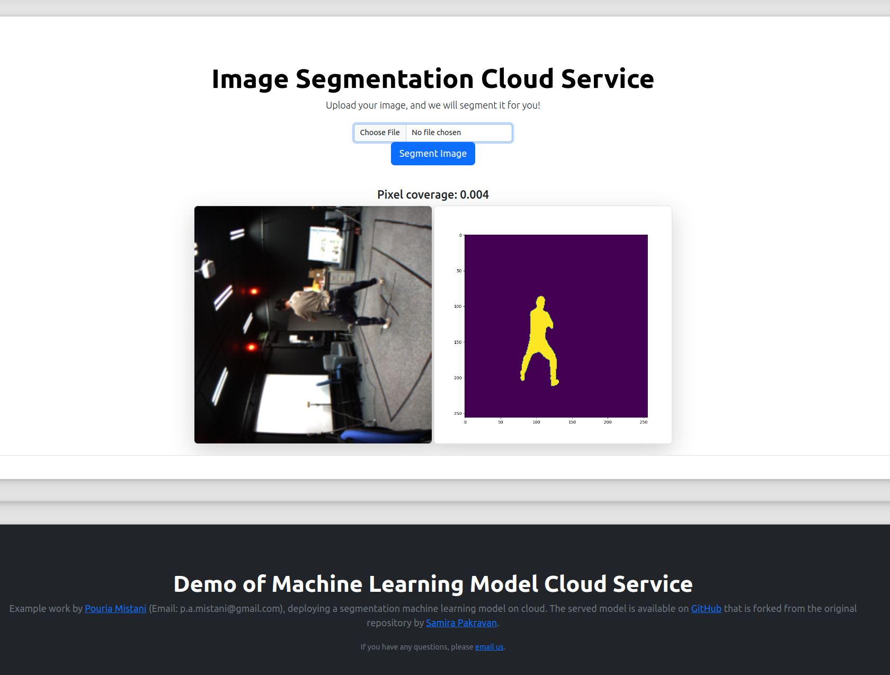

# Web app and cloud service development for the segmentation project described below


For running the production docker do 
```
docker run -it --gpus all -p 8080:8080 pourion/segmentation:latest
```

## Image Segmentation with Uncertainty Quantification
The algorithm is based on the paper https://pubmed.ncbi.nlm.nih.gov/31729078/ 

A U-Net architecture (with MC-Dropout layers) is trained over 4 vision datasets to predict segmentation tasks. 

## Project Report
A report summarizing implementation and results are provided in [report.pdf](https://github.com/samirapakravan/segmentation_uq/blob/main/report.pdf) in the repository.

## Development
### With Conda
Create the conda environment by `conda env create` from the repository, the new environment will be built based on `environment.yml` instructions. Note that the contents of `requirements.txt` will also be used to build the ``segment_uq`` environment.

Do `conda activate segment_uq` to activate the environment! An advantage of the provided conda environment is it will automatically install the latest version of `pytorch v2.0.0`.

### With Docker (recommended)
The docker environment is provided based on a highly optimized pytorch image from NVIDIA NGC. At this point, an optimized version for pytorch 2 is not yet available on NGC.

Create an account on ``ngc.nvidia.com`` and ``Create an API key`` and on your machine do ``docker login nvcr.io``, use the provided user/password to login to the ngc server.

To build the docker image ``./launch.sh build`` [ONLY the first time!] and to start it do ``./launch.sh dev -d``. Then in VS Code `` Ctrl+Shift+P`` and choose ``Attach to Running Container`` and choose ``vision`` from the running containers list.

### Instructions

- All training and prediction parameters are configured wuth the `conf/base.yaml` file.

- After activating the conda environment with `conda activate segment_uq` (or using the docker image), train the network with `python train.py` and generate predicted masks with standard-deviation estimates by `python predict.py`.

### OS/Hardware Requirements
Currently, this codebase is only tested on Linux Ubuntu machine with an RTX 3090 (with 24GB DRAM) or an RTX A6000 GPU (with 48GB DRAM) as well as 64GB of CPU RAM (you need at least 8.5GB DRAM for training on the Pascal dataset).
